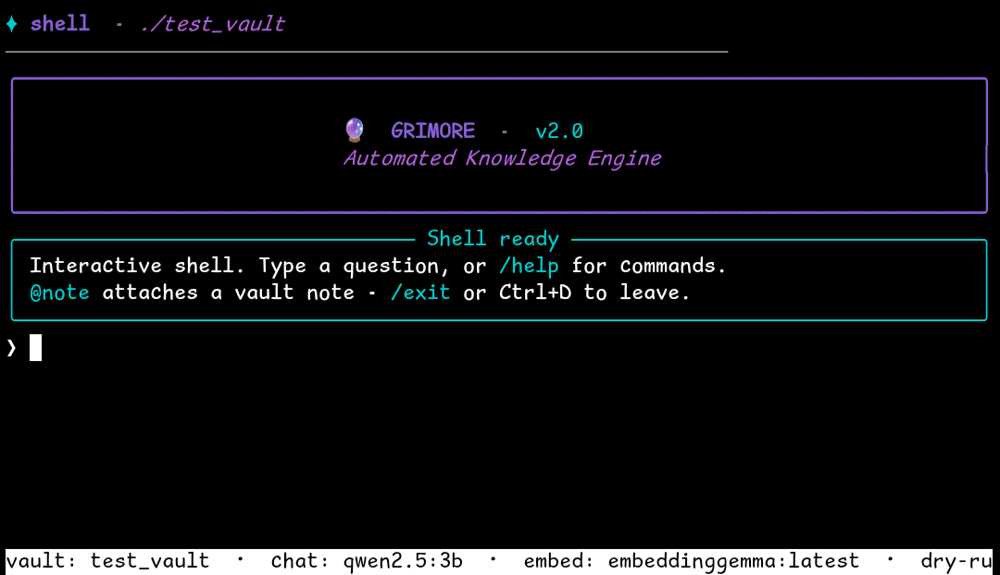
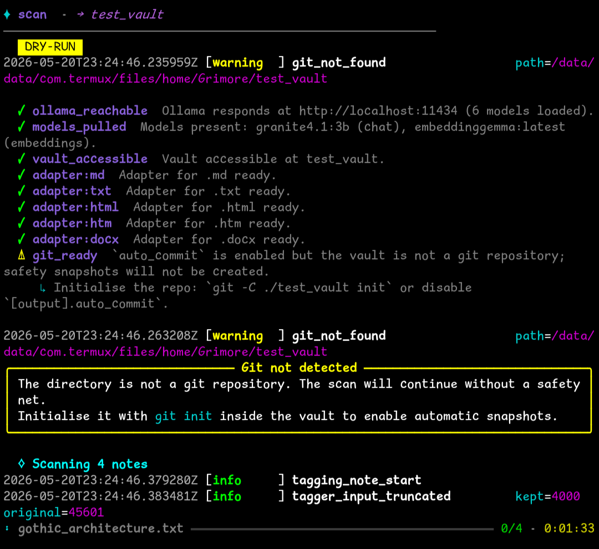
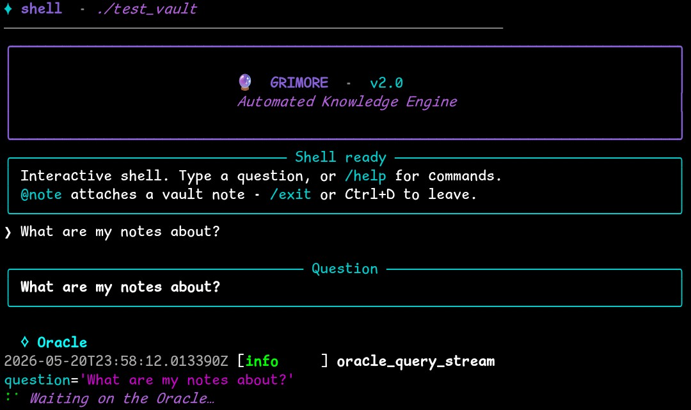
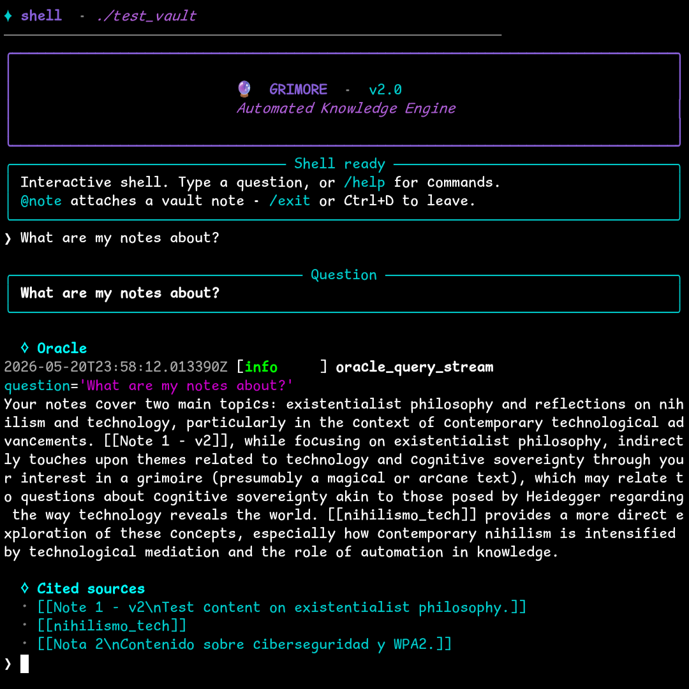
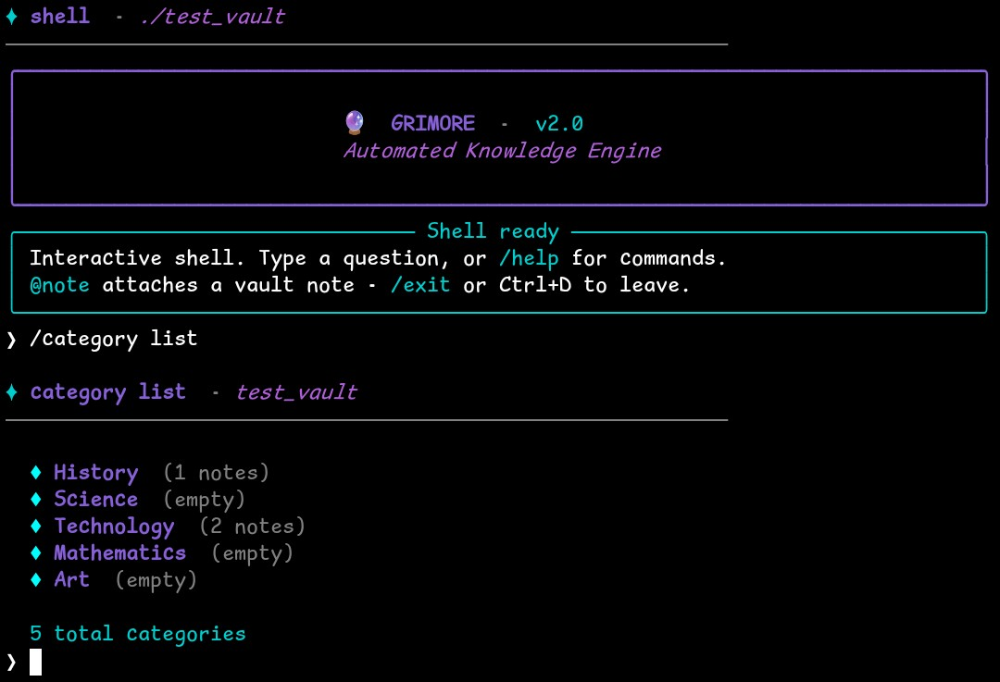
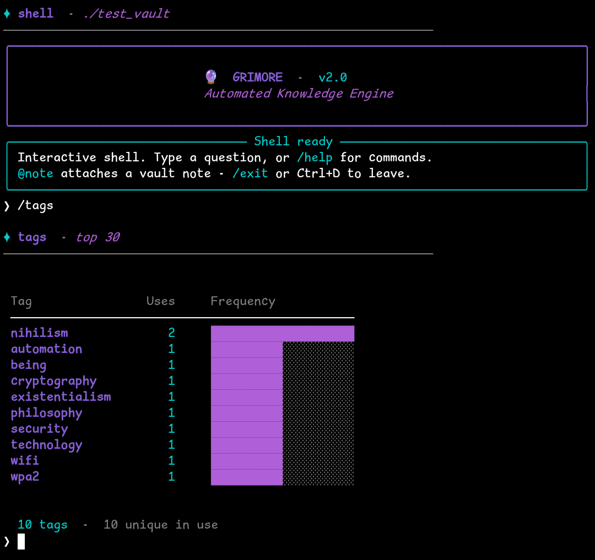
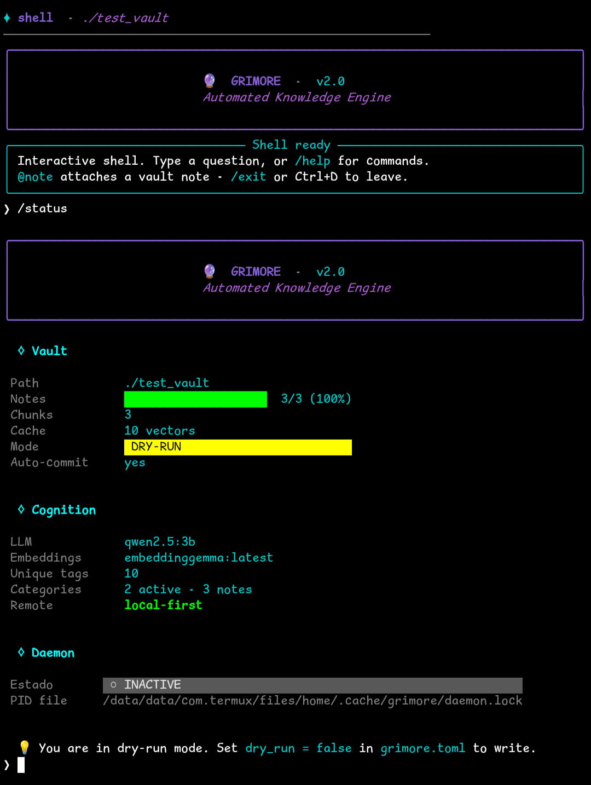
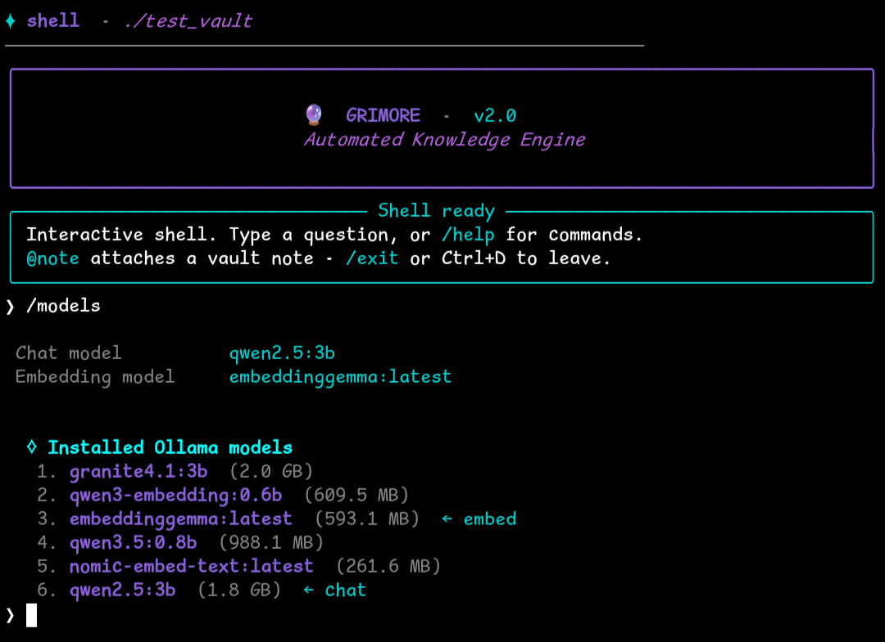
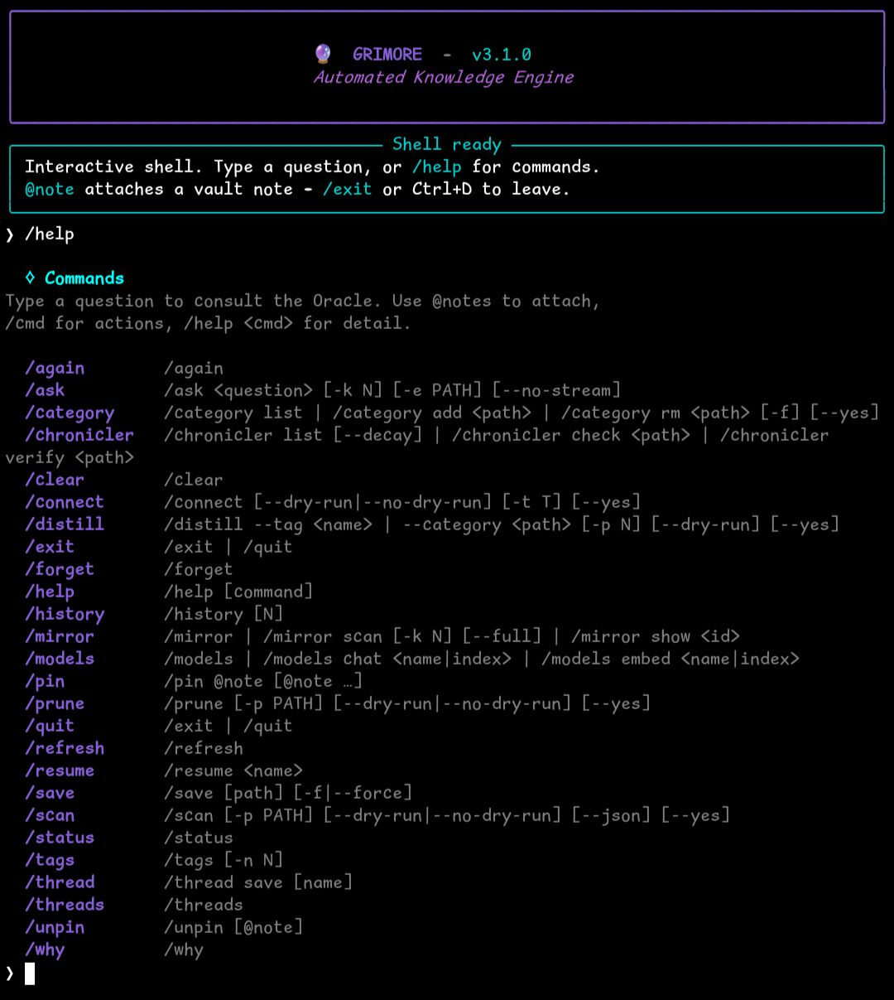
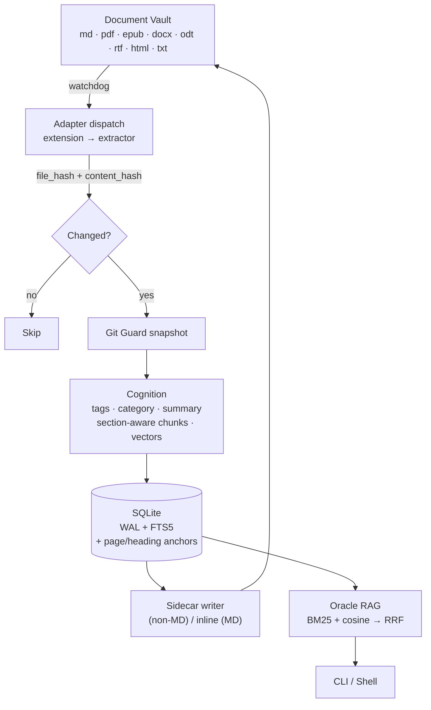

<div align="center">

```text
 ____    ____    ______            _____   ____    ____
/\  _`\ /\  _`\ /\__  _\   /'\_/`\/\  __`\/\  _`\ /\  _`\
\ \ \L\_\ \ \L\ \/_/\ \/  /\      \ \ \/\ \ \ \L\ \ \ \L\_\
 \ \ \L_L\ \ ,  /  \ \ \  \ \ \__\ \ \ \ \ \ \ ,  /\ \  _\L
  \ \ \/, \ \ \\ \  \_\ \__\ \ \_/\ \ \ \_\ \ \ \\ \\ \ \L\ \
   \ \____/\ \_\ \_\/\_____\\ \_\\ \_\ \_____\ \_\ \_\ \____/
    \/___/  \/_/\/ /\/_____/ \/_/ \/_/\/_____/\/_/\/ /\/___/
```

**An automated knowledge engine for your document vault**

[](#) [](https://www.python.org/) [](https://ollama.com/) [](LICENSE)

<br>



</div>

---

Grimore watches your vault — **Markdown, PDF, EPUB, DOCX, ODT, RTF, HTML, TXT** — auto-tags every document, builds a hybrid semantic index, and answers questions against it. Entirely through local LLMs. Nothing leaves your machine, and no API keys are required.

## See it in action

### Scan

One sweep over a mixed-format vault. Preflight verifies every adapter; watchdog keeps the index live thereafter.

<p align="center">
  
</p>

### Ask

Type a question, the Oracle streams back an answer with citations into your own notes.

<table>
<tr>
<td></td>
<td></td>
</tr>
</table>

### Browse

Categories and tags discovered automatically by the cognition pipeline — explore them from the shell.

<table>
<tr>
<td width="50%"></td>
<td width="50%"></td>
</tr>
</table>

### Inspect

Live counters, chosen models, daemon state — all from inside the shell.

<table>
<tr>
<td width="50%"></td>
<td width="50%"></td>
</tr>
</table>

### Discover

`/help` lists every slash-command at the prompt — no doc-diving required.

<p align="center">
  
</p>

## Quick start

Requires Python 3.11+, [Ollama](https://ollama.com) with a chat model (e.g. `qwen2.5:3b`) and an embedding model (e.g. `nomic-embed-text`) pulled, and a git-initialised vault.

```bash
git clone https://github.com/kahz12/Grimore-MD.git
cd Grimore-MD
python -m venv .venv && source .venv/bin/activate
pip install -e .

grimore preflight                                       # validate config + adapters
grimore scan --vault-path /path/to/vault --no-dry-run   # first full pass
grimore daemon start                                    # keep the index live
grimore shell                                           # conversational mode
```

Supported on **Linux**, **Windows**, and **Termux/Android** (heavy engines like PyMuPDF / OCR stay opt-in to keep the mobile install lean).

## Beyond the terminal

| Surface | What it does |
| :--- | :--- |
| `grimore mcp` | Stdio MCP server for Claude Desktop / Cursor / Zed. See [docs/mcp-setup.md](docs/mcp-setup.md). |
| `grimore serve` | Read-only HTTP API + minimal browser UI. Loopback by default; `--allow-lan` + `--api-token` for LAN. |
| `grimore graph export` | Dump the vault's link graph to JSON, Graphviz DOT, or Obsidian Canvas. |
| `--profile <name>` | Switch between named vault profiles defined as `[profiles.<name>]` in `grimore.toml`. |
| `/thread save\|resume\|list` | Persist shell conversations as JSONL under `~/.grimore/threads` and resume them across sessions. |
| OpenAI-compatible backend | Point Grimore at llama.cpp server, vLLM, LM Studio, OpenRouter or OpenAI by setting `[cognition].llm_backend = "openai"`. |

## Architecture



- **Ingest** — one adapter per format behind a registry. Two-tier change detection: cheap SHA-256 of the bytes gates the expensive extraction step, so re-scans of unchanged documents cost nothing.
- **Cognition** — local LLM tags, summarises and files each document into one hierarchical category. Section-aware chunking preserves PDF page numbers and DOCX/EPUB headings so citations come back as `[[Title#p.42]]`.
- **Memory** — SQLite in WAL mode with FTS5 alongside per-chunk vectors keyed by `sha256(model ‖ chunk)`, so swapping embedders invalidates cleanly.
- **Retrieval** — BM25 and cosine fused via Reciprocal Rank Fusion. Degrades to either side alone if the other is unavailable.
- **Writeback** — Markdown sources get inline frontmatter + a `## Suggested Connections` block. Binary formats (PDF, EPUB, DOCX, ODT) get a sidecar `.md` under `.grimore/sidecars/` — originals are never mutated.

## Privacy

Local-first by construction: with `cognition.allow_remote = false` (the default), Ollama calls are rejected unless the endpoint resolves to a loopback address. Every destructive operation defaults to `--dry-run`. PII detection, prompt-injection neutralisation, automatic git snapshots, and path containment via `SecurityGuard` round out the safety model — see the [user guide](docs/USER_GUIDE_EN.md#10-privacy--safety) for the full picture.

## Documentation

- 🇬🇧 [**English User Guide**](docs/USER_GUIDE_EN.md) — every command, the shell, configuration, troubleshooting.
- 🇪🇸 [**Guía de Usuario (Español)**](docs/USER_GUIDE_ES.md) — recorrido completo en español.

Terminal: `grimore <cmd> --help`. In the shell: `/help`.

## Stack

Python 3.11+ · Ollama · SQLite (WAL + FTS5) · Typer + Rich · prompt-toolkit · pypdf · beautifulsoup4 · striprtf · watchdog · structlog · GitPython

## License

Released under the [MIT License](LICENSE).
