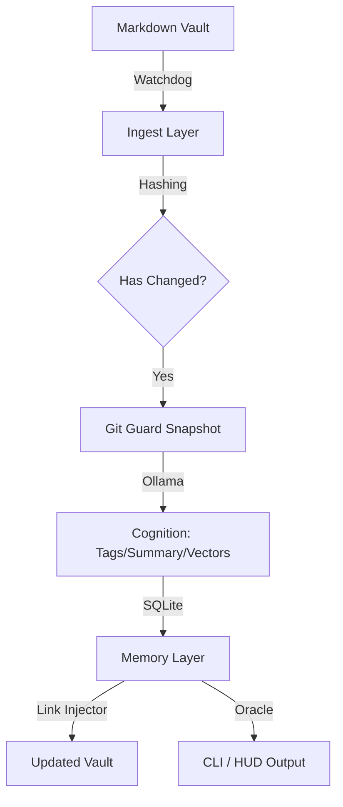

# 🧠 Project Grimoire v2.0
### *The Automated Knowledge Engine for Your Digital Cortex*

[](https://github.com/youruser/grimoire)
[](https://www.python.org/)
[](https://ollama.com/)
[](LICENSE)

```text
 ________  ________  ___  _____ ______   ________  ___  ________  _______      
|\   ____\|\   __  \|\  \|\   _ \  _   \|\   __  \|\  \|\   __  \|\  ___ \     
\ \  \___|\ \  \|\  \ \  \ \  \\\__\ \  \ \  \|\  \ \  \ \  \|\  \ \   __/|    
 \ \  \  __\ \   _  _\ \  \ \  \\|__| \  \ \  \\\  \ \  \ \   _  _\ \  \_|/__  
  \ \  \__\ \ \  \\  \\ \  \ \  \    \ \  \ \  \\\  \ \  \ \  \\  \\ \  \_| \ 
   \ \_______\ \__\\ _\\ \__\ \__\    \ \__\ \_______\ \__\ \__\\ _\\ \_______\
    \|_______|\|__|\|__|\|__|\|__|     \|__|\|_______|\|__|\|__|\|__|\|_______|
```

**Project Grimoire** is not just a tagging script. It is a **cognitive daemon** that lives in your system, observes your Markdown vault (Obsidian/Logseq), and builds a semantic index. It identifies connections between disparate ideas, auto-tags your thoughts, and allows you to "talk" to your own knowledge base using local LLMs.

---

## 🌑 Vision & Philosophy

In the age of information overload, your personal notes often become a "digital graveyard." Grimoire breathes life into them by:
1. **Sovereignty First:** Your thoughts never leave your network. It uses **Ollama** for local inference.
2. **Idempotence:** Every file is hashed. If the content hasn't changed, Grimoire won't waste a single CPU cycle.
3. **Safety First:** With the `Git Guard` system, an automatic snapshot is taken before any modification. 
4. **Non-Intrusive:** It works silently in the background (Daemon mode), notifying you only when significant connections are found.

---

## 🛠 Features

### 📡 1. Intelligent Ingestion
*   **Watchdog Integration:** Real-time monitoring of file system events.
*   **Debounce Logic:** Waits 45 seconds after your last save to ensure you've finished your thought before processing.
*   **Smart Parsing:** Separates YAML frontmatter from content, preserving your formatting and comments.

### 🧠 2. Local Cognition
*   **Auto-Tagging:** Generates relevant tags and 150-character summaries using `qwen2.5:3b`.
*   **Taxonomy Control:** Normalizes tags (e.g., `#Logic` vs `#logic`) to maintain a clean vocabulary.
*   **Semantic Embeddings:** Generates 768-dimension vectors for every note to find meaning beyond keywords.

### 🔗 3. Semantic Synthesis
*   **Automated Linking:** Discovers non-trivial connections between old and new notes.
*   **Link Injection:** Idempotently injects a `## 🔗 Suggested Connections` block into your files.
*   **Cosine Similarity:** Uses pure Python implementation for high-speed vector matching on mobile/desktop.

### 🔮 4. The Oracle (RAG)
*   **Knowledge Retrieval:** Ask your vault anything via `grimoire ask`.
*   **Citations:** Every answer includes wikilinks `[[Note Title]]` to your source material.
*   **Insight Export:** Save Oracle responses as new notes, automatically linked to their sources.

### 🛡️ 5. Hardening & Privacy
*   **Privacy Policies:** Set `privacy: never_process` in your frontmatter to exclude a note from cognition entirely.
*   **PII Filter:** Detects API keys, emails, IPs and SSH keys, logging a warning so you can review before processing is shared with any future remote backend.
*   **Prompt Sanitization:** Escapes `SYSTEM:` / `USER:` / `ASSISTANT:` markers in note content before LLM calls to reduce prompt-injection risk.
*   **Automated Backups:** Daemon performs a daily SQLite snapshot, keeping the last 5 rotations under `backups/`.

---

## 🏗 Architecture



---

## 🚀 Getting Started

### Prerequisites
*   **Python 3.11+**
*   **Ollama** (running `qwen2.5:3b` and `nomic-embed-text`)
*   **Git** (initialized in your vault)

### Installation
```bash
# Clone the repository
git clone https://github.com/youruser/grimoire.git
cd Grimoire

# Install dependencies
pip install -r requirements.txt
pip install -e .
```

---

## 📖 Usage

### Initial Scan
Index your entire vault for the first time (tags, summaries and embeddings are written in a single pass):
```bash
grimoire scan --vault-path /path/to/your/vault --no-dry-run
```

### Start the Daemon
Run Grimoire in the background (Termux/Ubuntu). Use `stop` / `status` to manage it:
```bash
grimoire daemon start
grimoire daemon status
grimoire daemon stop
```

### Dashboard
See vault metrics, indexed embeddings and daemon state:
```bash
grimoire status
```

### Consult the Oracle
Ask a question based on your notes:
```bash
grimoire ask "What are my main reflections on Heidegger's nihilism?" --export answer.md
```

### Discover Connections
Manual trigger for semantic link discovery:
```bash
grimoire connect --no-dry-run
```

---

## ⚙️ Configuration (`grimoire.toml`)

| Section | Key | Default | Description |
| :--- | :--- | :--- | :--- |
| `vault` | `path` | `./vault` | Path to your Markdown notes. |
| `vault` | `ignored_dirs` | `[".obsidian", ".trash", ".git", "Templates"]` | Directories skipped during scan/watch. |
| `cognition` | `model_llm_local` | `qwen2.5:3b` | Ollama model used for tagging and the Oracle. |
| `cognition` | `model_embeddings_local` | `nomic-embed-text` | Ollama model used for semantic vectors. |
| `cognition` | `allow_remote` | `false` | Reserved flag for future opt-in remote backends (not yet implemented). |
| `memory` | `db_path` | `grimoire.db` | SQLite file storing notes and embeddings. |
| `output` | `auto_commit` | `true` | Enables Git Guard pre-change snapshots. |
| `output` | `dry_run` | `true` | Prevents writes until disabled. |

---

## 🔮 Roadmap
*   **Phase 7.1: The Black Mirror** — Detection of contradictions between your own notes.
*   **Phase 7.2: MCP Server** — Query your Grimoire directly from the Claude.ai interface.
*   **Phase 7.3: Multi-Format** — Ingesting PDFs, EPUBs, and Web Clippings.

---

## 📜 License
Project Grimoire is open-source software licensed under the **MIT License**.

*Build your digital cortex. Own your data. Automate your wisdom.*
