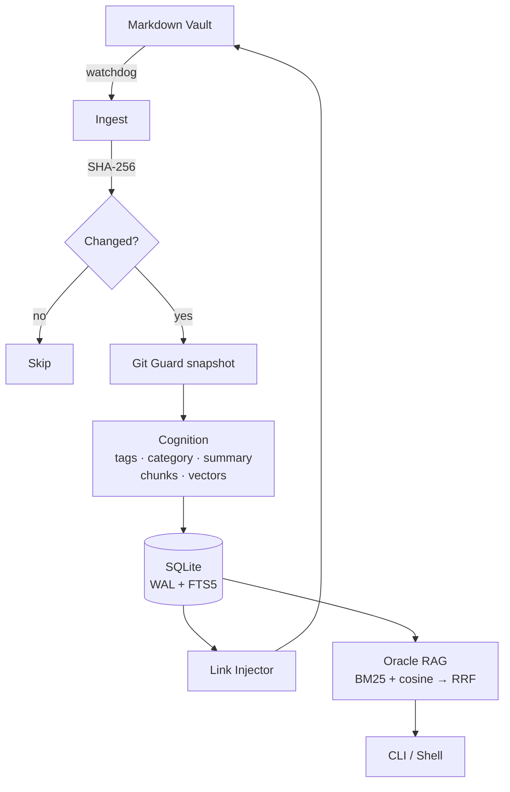

<div align="center">

```text
 ____    ____    ______            _____   ____    ____
/\  _`\ /\  _`\ /\__  _\   /'\_/`\/\  __`\/\  _`\ /\  _`\
\ \ \L\_\ \ \L\ \/_/\ \/  /\      \ \ \/\ \ \ \L\ \ \ \L\_\
 \ \ \L_L\ \ ,  /  \ \ \  \ \ \__\ \ \ \ \ \ \ ,  /\ \  _\L
  \ \ \/, \ \ \\ \  \_\ \__\ \ \_/\ \ \ \_\ \ \ \\ \\ \ \L\ \
   \ \____/\ \_\ \_\/\_____\\ \_\\ \_\ \_____\ \_\ \_\ \____/
    \/___/  \/_/\/ /\/_____/ \/_/ \/_/\/_____/\/_/\/ /\/___/
```

**An automated knowledge engine for your Markdown vault**

[](#) [](https://www.python.org/) [](https://ollama.com/) [](LICENSE)

</div>

---

Grimore watches your Markdown vault, auto-tags every note, builds a hybrid semantic index, and answers questions against it — entirely through local LLMs. Nothing leaves your machine, and no API keys are required.

## Quick start

Requires Python 3.11+, [Ollama](https://ollama.com) with a chat model (e.g. `qwen2.5:3b`) and an embedding model (e.g. `nomic-embed-text`) pulled, and a git-initialised vault.

```bash
git clone https://github.com/kahz12/Grimore-MD.git
cd Grimore-MD
python -m venv .venv && source .venv/bin/activate
pip install -e .

grimore preflight                                       # validate config + Ollama
grimore scan --vault-path /path/to/vault --no-dry-run   # first full pass
grimore daemon start                                    # keep the index live
grimore shell                                           # conversational mode
```

## Documentation

Detailed user guides live in [`docs/`](docs/):

- 🇬🇧 [**English User Guide**](docs/USER_GUIDE_EN.md) — full walk-through of every command, the interactive shell, configuration, privacy model, and troubleshooting.
- 🇪🇸 [**Guía de Usuario (Español)**](docs/USER_GUIDE_ES.md) — recorrido completo de cada comando, la shell interactiva, configuración, privacidad y solución de problemas.

For a flag list at the terminal: `grimore <cmd> --help`. Inside `grimore shell`, type `/help` for the slash-command reference.

## Architecture



- **Ingest** — watchdog observer with a 45 s debounce; SHA-256 idempotency means unchanged notes cost nothing on re-scan.
- **Cognition** — local LLM tags, summarises and files each note into one hierarchical category. A 5-failure circuit breaker opens a 120 s cooldown rather than thrashing Ollama.
- **Memory** — SQLite in WAL mode with FTS5 alongside per-chunk vectors keyed by `sha256(model ‖ chunk)`, so swapping embedders invalidates cleanly.
- **Retrieval** — BM25 and cosine fused via Reciprocal Rank Fusion. Degrades to either side alone if the other is unavailable.
- **Synthesis** — `connect` maintains an idempotent `## Suggested Connections` block of wikilinks; `ask` runs RAG over the hybrid index and cites back to your own notes. `distill` fuses notes sharing a tag or category into a single reference note; `chronicler` flags stale notes; `mirror` (the Black Mirror) surfaces contradictions across notes.

## Privacy

Local-first by construction: with `cognition.allow_remote = false` (the default), Ollama calls are rejected unless the endpoint resolves to a loopback address. Every destructive operation defaults to `--dry-run`. PII detection, prompt-injection neutralisation, automatic git snapshots and path containment via `SecurityGuard` round out the safety model — see the [user guide](docs/USER_GUIDE_EN.md#10-privacy--safety) for the full picture.

## Stack

Python 3.11+ · Ollama · SQLite (WAL + FTS5) · Typer + Rich · prompt-toolkit · rapidfuzz · watchdog · structlog · GitPython · platformdirs

## License

Released under the [MIT License](LICENSE).
