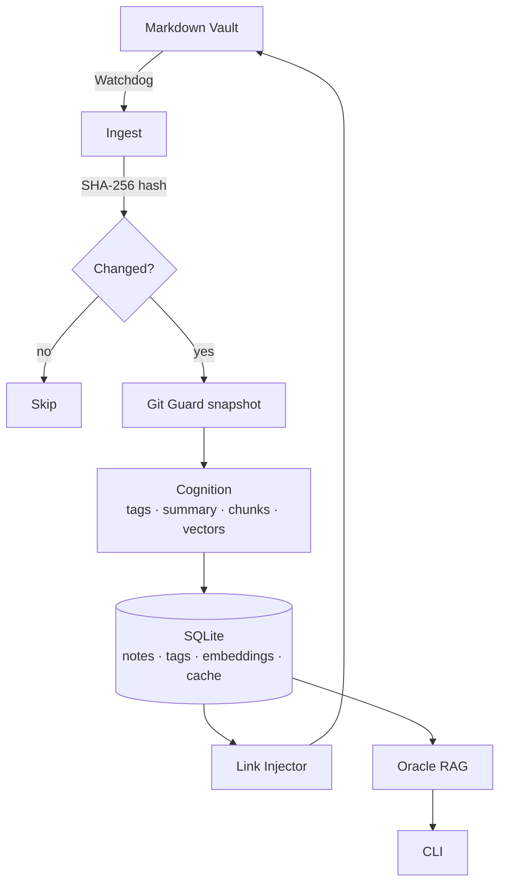

<div align="center">

```text
 ________  ________  ___  _____ ______   ________  ___  ________  _______
|\   ____\|\   __  \|\  \|\   _ \  _   \|\   __  \|\  \|\   __  \|\  ___ \
\ \  \___|\ \  \|\  \ \  \ \  \\\__\ \  \ \  \|\  \ \  \ \  \|\  \ \   __/|
 \ \  \  __\ \   _  _\ \  \ \  \\|__| \  \ \  \\\  \ \  \ \   _  _\ \  \_|/__
  \ \  \|\  \ \  \\  \\ \  \ \  \    \ \  \ \  \\\  \ \  \ \  \\  \\ \  \_|\ \
   \ \_______\ \__\\ _\\ \__\ \__\    \ \__\ \_______\ \__\ \__\\ _\\ \_______\
    \|_______|\|__|\|__|\|__|\|__|     \|__|\|_______|\|__|\|__|\|__|\|_______|
```

### *An automated knowledge engine for your Markdown vault*

[](#)
[](https://www.python.org/)
[](https://ollama.com/)
[](LICENSE)

*Sense the vault · surface connections · wake the Oracle*

</div>

---

**Grimoire** watches your Markdown vault, auto-tags each note, builds a semantic index, and lets you *talk* to your own knowledge base — all through local LLMs. No data leaves your machine.

## Table of contents

- [Why Grimoire](#why-grimoire)
- [Features](#features)
- [Architecture](#architecture)
- [Installation](#installation)
- [Quick start](#quick-start)
- [CLI reference](#cli-reference)
- [Configuration](#configuration)
- [Controlled taxonomy](#controlled-taxonomy)
- [Privacy & safety](#privacy--safety)
- [Tech stack](#tech-stack)
- [Roadmap](#roadmap)
- [License](#license)

## Why Grimoire

> *Your notes are a graveyard of good ideas until something wires them together.*

| Principle | What it means in practice |
| :--- | :--- |
| **Sovereignty first** | All inference runs through [Ollama](https://ollama.com). Nothing is shipped to a third party. |
| **Idempotent** | Every note is SHA-256 hashed. Unchanged notes cost zero CPU cycles on re-scan. |
| **Reversible** | `Git Guard` snapshots the vault before every write, `--dry-run` is the default. |
| **Non-intrusive** | Runs as a daemon in the background; surfaces insights only when they're worth your attention. |

## Features

### Ingestion
- **Watchdog integration** — real-time filesystem events, debounced 45 s to let you finish a thought.
- **Frontmatter-aware parsing** — preserves YAML metadata, formatting, and comments on write-back.
- **Hash-keyed idempotency** — a file is only re-processed when its content hash changes.

### Cognition
- **Auto-tagging & summaries** — `qwen2.5:3b` by default; tags are normalised (accents stripped, lowercased, hyphenated) and reconciled against your controlled vocabulary.
- **Chunked embeddings** — notes are split into overlapping chunks (1 500 char / 150 overlap) so retrieval works at paragraph granularity.
- **Embedding cache** — vectors are keyed by `sha256(model || chunk)`, so swapping embedding models invalidates cleanly without re-embedding identical text.
- **Circuit breaker** — five consecutive LLM failures open a 120 s cooldown instead of thrashing Ollama.

### Memory
- **SQLite + WAL** — concurrent reads (CLI) while the daemon writes; indexed on `note_id` for fast joins.
- **Tag persistence** — associations live in `note_tags`; `grimoire tags` shows a frequency table.
- **Stale-note pruning** — `grimoire prune` drops DB rows for notes that no longer exist on disk, cascading to tags and embeddings.

### Synthesis
- **Semantic linking** — cosine similarity (dot product on pre-normalised vectors) surfaces non-obvious connections.
- **Idempotent link injection** — a single `## 🔗 Suggested Connections` block, updated in place.

### The Oracle (RAG)
- **Grounded Q&A** — `grimoire ask` retrieves relevant chunks, composes a local-LLM answer, and cites sources as wikilinks.
- **Insight export** — save responses back into the vault as first-class, linked notes.

### Visual layer
- **Themed CLI** — a cohesive Rich-based theme (panels, progress bars, dashboards) so every command feels part of the same ritual.
- **Mode badges** — `DRY-RUN` / `LIVE` / daemon status at a glance.

## Architecture



## Installation

**Prerequisites**

- Python **3.11+**
- [Ollama](https://ollama.com) with `qwen2.5:3b` and `nomic-embed-text` pulled
- A git-initialised Markdown vault (required for Git Guard)

**Setup**

```bash
git clone https://github.com/youruser/grimoire.git
cd Grimoire

python -m venv .venv && source .venv/bin/activate
pip install -r requirements.txt
pip install -e .
```

Verify the install:

```bash
grimoire status
```

## Quick start

```bash
# 1 — First full pass (writes tags, summaries, embeddings)
grimoire scan --vault-path /path/to/vault --no-dry-run

# 2 — Start the daemon in the background
grimoire daemon start

# 3 — Ask the Oracle
grimoire ask "What threads through my notes on Heidegger's nihilism?"
```

## CLI reference

| Command | Panel | What it does |
| :--- | :--- | :--- |
| `grimoire scan` | Knowledge ops | Walk the vault, tag changed notes, refresh embeddings. |
| `grimoire connect` | Knowledge ops | Discover semantic links and inject wikilinks. |
| `grimoire ask <q>` | Knowledge ops | Query the Oracle (RAG) with citations. |
| `grimoire tags` | Knowledge ops | Frequency table of tags currently in use. |
| `grimoire daemon <action>` | Daemon | `run` · `start` · `stop` · `status`. |
| `grimoire prune` | System | Remove DB entries for notes gone from disk. |
| `grimoire status` | System | Full dashboard: vault · cognition · daemon. |

Run `grimoire <cmd> --help` for flags and examples.

## Configuration

Config lives in `grimoire.toml` at the project root.

| Section | Key | Default | Purpose |
| :--- | :--- | :--- | :--- |
| `vault` | `path` | `./vault` | Root of your Markdown notes. |
| `vault` | `ignored_dirs` | `[".obsidian", ".trash", ".git", "Templates"]` | Skipped during scan / watch. |
| `cognition` | `model_llm_local` | `qwen2.5:3b` | Ollama model for tagging and the Oracle. |
| `cognition` | `model_embeddings_local` | `nomic-embed-text` | Ollama model for semantic vectors. |
| `cognition` | `allow_remote` | `false` | Reserved for future opt-in remote backends. |
| `memory` | `db_path` | `grimoire.db` | SQLite file for notes, tags and embeddings. |
| `output` | `auto_commit` | `true` | Git Guard pre-change snapshots. |
| `output` | `dry_run` | `true` | Prevents writes until explicitly disabled. |

## Controlled taxonomy

Drop a `taxonomy.yml` at the **root of your vault** to pin your tag vocabulary:

```yaml
vocabulary:
  - filosofia
  - ocultismo-clasico
  - nihilismo
  - epistemologia
```

Each LLM-emitted tag is normalised (`"Ocultismo Clásico"` → `ocultismo-clasico`) and, when a normalised form is in the vocabulary, rewritten to its canonical spelling. Unknown tags are kept verbatim — the taxonomy steers, it does not gatekeep.

Malformed or missing files fall back to an empty taxonomy silently, so ingestion is never blocked.

## Privacy & safety

- **Per-note opt-out** — set `privacy: never_process` in a note's frontmatter and it's excluded from cognition entirely.
- **PII detection** — API keys, emails, IPs and SSH keys are flagged in logs before any LLM call.
- **Prompt-injection hardening** — `SYSTEM:` / `USER:` / `ASSISTANT:` markers in note content are escaped before being sent to the LLM.
- **Git Guard** — every mutation is preceded by an auto-commit, so `git reflog` is always your undo.
- **Rolling backups** — the daemon checkpoints the SQLite DB daily, keeping the last five under `backups/`.

## Tech stack

| Layer | Stack |
| :--- | :--- |
| **Runtime** | Python 3.11+ |
| **LLM** | Ollama (`qwen2.5:3b` · `nomic-embed-text`) |
| **Storage** | SQLite (WAL mode) |
| **CLI / UX** | Typer + Rich |
| **Ingest** | watchdog · python-frontmatter · markdown-it-py |
| **Observability** | structlog |
| **VCS** | GitPython |

## Roadmap

- **7.1 — The Black Mirror** · automatic detection of contradictions across your own notes.
- **7.2 — MCP server** · query Grimoire directly from Claude and other MCP-aware clients.
- **7.3 — Multi-format ingest** · PDFs, EPUBs, and web clippings alongside Markdown.

## License

Released under the [**MIT License**](LICENSE).

<div align="center">

*Build your digital cortex. Own your data. Automate your wisdom.*

</div>
