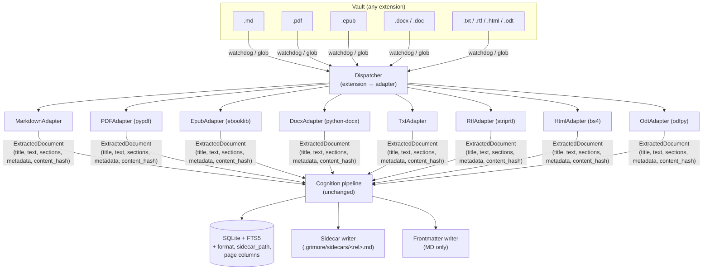

# Multi-Format Ingestion Blueprint

> Goal: extend Grimore so the vault is no longer Markdown-only. PDFs, ePubs,
> Word docs, plain text, RTF, HTML and ODT files must be ingested, tagged,
> embedded and made queryable through the existing RAG pipeline — without
> regressing the `.md` experience and without breaking the local-first /
> privacy-by-default contract.

---

## 1. Why this matters

Today the vault model is one extension wide. Every layer of the pipeline
hard-codes `.md`:

| Layer                       | File / symbol                                  | Coupling                                        |
|----------------------------|-----------------------------------------------|------------------------------------------------|
| Watcher                    | `grimore/ingest/observer.py:28`               | `raw_path.endswith(".md")`                     |
| Full-vault sweep (CLI)     | `grimore/cli.py:164` and `:563`               | `actual_vault_path.glob("**/*.md")`            |
| Shell `@mention` index     | `grimore/shell.py:1186`                       | `vault_root.rglob("*.md")` + `f"{token}.md"`   |
| Parser                     | `grimore/ingest/parser.py`                    | `frontmatter.load()` assumes YAML+Markdown     |
| Writer                     | `grimore/output/frontmatter_writer.py`        | `frontmatter.dump()` rewrites the source file  |
| Link injector              | `grimore/output/link_injector.py`             | Appends `## 🔗 Suggested Connections` to source|
| Synthesizer output         | `grimore/cognition/synthesizer.py:10`         | Writes `_synthesis/<slug>.md`                  |
| Chunker                    | `grimore/cognition/chunker.py`                | Splits on blank-line paragraphs (text already) |
| DB schema                  | `grimore/memory/db.py:50`                     | `notes(path UNIQUE, title, content_hash, …)` — no `format`, no `sidecar_path` |

Most of the cognition layer (LLM router, embedder, tagger, oracle, mirror,
chronicler, synthesizer) is already format-agnostic — it consumes a `str`.
The work to support multi-format is therefore concentrated in **ingest**,
**output**, and the **DB schema**. Everything downstream stays put.

---

## 2. Guiding principles

1. **Markdown remains a first-class citizen.** `.md` keeps inline-frontmatter
   round-tripping and inline link injection. No `.md` user notices the
   refactor.
2. **Never mutate binary or non-MD source files.** PDFs, ePubs, DOCX, ODT are
   binary or fragile XML; appending a markdown section would corrupt them.
   For these formats, all written metadata lives in a **sidecar `.md`** or
   in the database.
3. **One adapter per format**, registered behind a single
   `DocumentExtractor` interface. The dispatcher decides what to call from
   the file extension (and, optionally, magic bytes for misnamed files).
4. **Two-tier change detection.** Hash file bytes first (cheap fast-skip);
   only re-extract + re-hash text when the byte hash differs. This keeps
   PDF re-scans nearly free.
5. **Local-first, pure-Python by default.** Every required dependency must
   work on Linux, Windows *and* Termux. Heavier engines (PyMuPDF, OCR) are
   strictly optional extras gated by config.
6. **Page / chapter awareness where the format provides it.** Citations gain
   precision — `[[Book Title#p.42]]` or `[[Spec.docx#§3.2]]` rather than a
   bare title — and the chunker can prefer natural boundaries.
7. **Backwards-compatible DB migration.** New columns default to MD
   semantics for every existing row.

---

## 3. End-to-end architecture



`ExtractedDocument` is the lingua franca handed to the rest of Grimore:

```python
@dataclass(frozen=True)
class ExtractedSection:
    """One natural unit of a document (a chapter, a page, an H2 block)."""
    text: str
    # Optional anchors the format provides:
    page: Optional[int] = None        # PDF, paginated PDFs only
    heading: Optional[str] = None     # ePub chapter, DOCX heading, HTML <h*>
    order: int = 0                    # stable ordering for chunk indices

@dataclass(frozen=True)
class ExtractedDocument:
    source_path: Path                 # original file as on disk
    format: str                       # "md" | "pdf" | "epub" | "docx" | …
    title: str                        # see §6.3 for fallback chain
    metadata: dict[str, Any]          # YAML-frontmatter-compatible dict
    text: str                         # concatenated body text
    sections: list[ExtractedSection]  # may be empty for formats w/o anchors
    content_hash: str                 # SHA-256 of normalised `text`
    file_hash: str                    # SHA-256 of raw bytes (fast-skip key)
```

---

## 4. Adapter interface and registry

A single protocol, one tiny module per format. Registration is a decorator;
the dispatcher is a dict lookup with a fallback for misnamed files (magic
sniff via `python-magic` if installed, else extension only — magic stays
optional so the install footprint on Termux remains small).

```python
# grimore/ingest/adapters/base.py

class DocumentExtractor(Protocol):
    extensions: ClassVar[tuple[str, ...]]            # ("pdf",)
    binary: ClassVar[bool]                           # True → no inline frontmatter
    mutable_frontmatter: ClassVar[bool]              # True → may write back to source

    def extract(
        self,
        path: Path,
        *,
        vault_root: Path,
        options: AdapterOptions,
    ) -> ExtractedDocument: ...

# grimore/ingest/registry.py

_REGISTRY: dict[str, DocumentExtractor] = {}

def register(extractor: DocumentExtractor) -> DocumentExtractor:
    for ext in extractor.extensions:
        _REGISTRY[ext.lower().lstrip(".")] = extractor
    return extractor

def for_path(path: Path) -> Optional[DocumentExtractor]:
    return _REGISTRY.get(path.suffix.lower().lstrip("."))
```

`MarkdownParser` keeps its public surface (`parse_file → ParsedNote`) for
backwards compatibility but is rewrapped as `MarkdownAdapter` under the
hood. Existing call sites continue to work; new code prefers the
dispatcher.

### 4.1 Per-format adapter notes

| Format  | Library (default)     | Notes                                                                                  |
|---------|----------------------|----------------------------------------------------------------------------------------|
| `md`    | python-frontmatter   | Current behaviour. `mutable_frontmatter = True`, `binary = False`.                     |
| `txt`   | stdlib               | UTF-8 with `errors="replace"`. No metadata, no sections. `mutable_frontmatter = False`.|
| `html`  | beautifulsoup4       | Strip `<script>`/`<style>`, prefer `<main>`/`<article>` if present, sections = `<h1-6>`.|
| `pdf`   | pypdf                | Pages → sections. Title from `info.title` or first heading. Capture page anchor.       |
| `epub`  | ebooklib + bs4       | Chapters → sections. Title from OPF metadata.                                          |
| `docx`  | python-docx          | Paragraphs grouped by heading style → sections. Core props for metadata.               |
| `rtf`   | striprtf             | `rtf_to_text(...)`. No reliable headings; one big section.                             |
| `odt`   | odfpy                | Walk `<text:h>` / `<text:p>`. Metadata from `meta.xml`.                                |
| `doc`   | optional: antiword   | Legacy binary. Try `antiword` if on PATH, else surface a friendly skip warning.        |

Optional, opt-in engines (set via `[ingest]` in `grimore.toml`):

- `pdfplumber` — better column / table handling for PDFs that aren't pure prose.
- `pymupdf` — best quality, but AGPL. Off by default; users must
  acknowledge in `grimore.toml` (`pdf_engine = "pymupdf"`).
- `pytesseract + pdf2image` — OCR fallback when a page has no extractable
  text. Activated only with `[ingest] ocr = true` *and* the user has
  Tesseract on PATH. Preflight verifies both.

---

## 5. Database changes

A small, idempotent migration. All new columns nullable; existing rows
backfill to MD semantics.

```sql
-- 0001_multiformat.sql (applied by Database._init_db)

ALTER TABLE notes ADD COLUMN format         TEXT DEFAULT 'md';
ALTER TABLE notes ADD COLUMN file_hash      TEXT;        -- raw bytes, fast-skip
ALTER TABLE notes ADD COLUMN sidecar_path   TEXT;        -- NULL for native MD
ALTER TABLE notes ADD COLUMN size_bytes     INTEGER;

ALTER TABLE embeddings ADD COLUMN page      INTEGER;     -- PDF page anchor
ALTER TABLE embeddings ADD COLUMN heading   TEXT;        -- DOCX/HTML/EPUB anchor

CREATE INDEX IF NOT EXISTS idx_notes_format ON notes(format);
```

`upsert_note(...)` gains optional `format`, `file_hash`, `sidecar_path`,
`size_bytes` keyword args. Callers that omit them get the MD defaults — so
old code paths and old tests stay green.

The FTS5 index doesn't need schema changes; it remains over
`embeddings.text_content`. The two new embedding columns are surfaced in
citation rendering but not in the search query.

---

## 6. Ingest pipeline changes

### 6.1 Watcher

`grimore/ingest/observer.py:28` — replace the substring filter with a
registry lookup:

```python
# was: if not raw_path.endswith(".md"):
ext = Path(raw_path).suffix.lower().lstrip(".")
if ext not in supported_extensions:
    return
```

`supported_extensions` is supplied at observer construction time from
`config.vault.formats` (see §8).

### 6.2 Full-vault sweep

`grimore/cli.py:164` and `:563` — replace the single glob with an
extension loop. `Path.glob` doesn't grok `{md,pdf}`-style brace expansion,
so iterate:

```python
files: list[Path] = []
for ext in config.vault.formats:
    for f in actual_vault_path.rglob(f"*.{ext}"):
        if is_ignored_path(f, config.vault.ignored_dirs):
            continue
        try:
            SecurityGuard.resolve_within_vault(f, vault_root)
        except ValueError:
            continue
        files.append(f)
```

Sort the result deterministically so progress feels stable across reruns.

### 6.3 Parser dispatcher

`MarkdownParser.parse_file` keeps its signature (for backwards compat).
Internally it becomes a one-line shim:

```python
def parse_file(self, file_path, *, vault_root=None) -> ParsedNote:
    extractor = registry.for_path(file_path) or MarkdownAdapter()
    doc = extractor.extract(file_path, vault_root=vault_root, options=…)
    return ParsedNote.from_extracted(doc)   # adapter-agnostic
```

`ParsedNote` gains:

- `format: str`
- `sections: list[ExtractedSection]` (empty for MD)
- `file_hash: str`

so the cognition + DB layer can flow these through without further plumbing.

### 6.4 Two-tier change detection

`scan` and `daemon.process_file` get a cheap fast-skip:

```python
file_hash = sha256_file(file_path)              # cheap
if db.get_file_hash(str(file_path)) == file_hash:
    stats["unchanged"] += 1
    continue                                    # done — no extraction

note = parser.parse_file(file_path, vault_root=vault_root)
if db.get_content_hash(str(file_path)) == note.content_hash:
    db.update_file_hash(str(file_path), file_hash)
    stats["unchanged"] += 1
    continue                                    # re-saved without text change
```

This keeps PDF re-scans almost free even though extraction itself is
expensive.

### 6.5 Title fallback chain (per format)

| Format | Order of fallbacks                                                                 |
|--------|-------------------------------------------------------------------------------------|
| md     | frontmatter `title` → first `# H1` → filename stem                                  |
| pdf    | `info.Title` → first non-empty heading on page 1 → filename stem                    |
| epub   | OPF `<dc:title>` → filename stem                                                    |
| docx   | core props `title` → first paragraph styled "Heading 1" → filename stem             |
| txt    | filename stem                                                                       |
| rtf    | filename stem                                                                       |
| html   | `<title>` → first `<h1>` → filename stem                                            |
| odt    | meta `<dc:title>` → first `<text:h text:outline-level="1">` → filename stem         |

### 6.6 Size + safety caps

`MAX_NOTE_BYTES` (currently 2 MB) is too small for PDFs. Move to a
per-format cap in config:

```toml
[ingest.max_bytes]
md = 2_000_000
txt = 5_000_000
html = 10_000_000
docx = 25_000_000
odt = 25_000_000
rtf = 25_000_000
epub = 50_000_000
pdf = 100_000_000
```

All extraction code wraps untrusted bytes in `try/except` and surfaces a
structured `extract_failed` log line rather than crashing the scan.

---

## 7. Output / write-back changes

### 7.1 The sidecar model

For every non-MD document, Grimore writes a sidecar `.md` whose path
mirrors the source under `vault/.grimore/sidecars/`:

```
vault/
  Books/
    Designing Data-Intensive Applications.epub        ← original, untouched
  .grimore/
    sidecars/
      Books/
        Designing Data-Intensive Applications.epub.md ← sidecar
```

The sidecar holds:

```markdown
---
title: "Designing Data-Intensive Applications"
source: "Books/Designing Data-Intensive Applications.epub"
format: "epub"
content_hash: "…"
file_hash: "…"
tags: [systems, distributed-systems, databases]
category: "tech/distributed-systems"
summary: "…"
last_tagged: "2026-05-20T14:00:00Z"
grimore_sidecar: true
---

# Designing Data-Intensive Applications

> Auto-generated by Grimore. The original document lives at
> [[Books/Designing Data-Intensive Applications.epub]] — edit there,
> then re-run `grimore scan`.

## 🔗 Suggested Connections
- [[The Log: What every software engineer should know]] — both cover
  replicated state machines.
- …
```

Properties:

- Sidecars are themselves *valid* Markdown notes, so Obsidian users can
  open and link them naturally.
- `grimore_sidecar: true` excludes them from the source-set of
  `distill`, `mirror` and `connect` (similar to the existing
  `grimore_generated: true` flag used by the Synthesizer).
- The sidecar tree is rooted at `.grimore/sidecars/` (under
  `vault.ignored_dirs` by default? **No** — it must be scanned for
  wikilinks but excluded from re-ingest. Implementation: skip
  re-extraction when `format == "md"` *and* frontmatter has
  `grimore_sidecar: true`.)
- The DB tracks both the original `path` and `sidecar_path`, so the
  shell's `@mention` resolver and the Oracle's citation renderer can
  pick the right target.

Why a sidecar tree (not adjacent files): adjacent `.grimore.md` files
litter user-visible directories and may confuse tools that filter by
`.md`. A single hidden root is simple to gitignore, easy to wipe, and
preserves directory structure for orientation.

### 7.2 Decision matrix: where do tags / suggested links live?

| Format | Frontmatter target | Suggested Connections target | DB authoritative? |
|--------|-------------------|------------------------------|-------------------|
| md     | inline (today)    | inline (today)               | yes (mirrors)     |
| any other | sidecar .md frontmatter | sidecar .md body       | yes (source of truth) |

The DB is *always* the source of truth for queries; sidecars are a
materialized view for human / Obsidian consumption.

### 7.3 Writer changes

`grimore/output/frontmatter_writer.py` gains a strategy split:

```python
def write_metadata(self, note: ParsedNote, updates: dict, *, dry_run: bool):
    if note.format == "md":
        return self._write_inline(note.path, updates, dry_run=dry_run)
    return self._write_sidecar(note, updates, dry_run=dry_run)
```

`LinkInjector.inject_links` becomes:

```python
def inject_links(self, note: ParsedNote, connections, *, dry_run: bool):
    target = note.path if note.format == "md" else note.sidecar_path
    if target is None:
        logger.warning("link_inject_skipped", reason="no_writable_target", path=str(note.path))
        return
    # …existing logic, but written to `target`
```

Atomicity (`atomic_write`) and the existing `## 🔗 Suggested Connections`
replace-or-append regex are unchanged — the file we're writing is always
markdown.

### 7.4 Git Guard

`GitGuard.commit_pre_change` already takes a path. For non-MD writes the
*sidecar* is what we touch — that's what gets snapshotted. The original
binary is never written to and therefore never needs a pre-change commit.
Behaviour is unchanged for MD.

---

## 8. Configuration surface

Additions to `grimore.toml` (defaults shown):

```toml
[vault]
path = "./vault"
ignored_dirs = [".obsidian", ".trash", ".git", "Templates"]
formats = ["md", "pdf", "epub", "docx", "txt", "rtf", "html", "odt"]
# Hidden sidecar root for non-MD documents. Relative to vault.
sidecar_dir = ".grimore/sidecars"
# Set false to keep all non-MD metadata DB-only (no sidecars on disk).
write_sidecars = true

[ingest]
# Optional engine overrides. Default extractors are pure-Python.
pdf_engine = "pypdf"          # "pypdf" | "pdfplumber" | "pymupdf"
ocr = false                   # require explicit opt-in; needs tesseract
# Magic-byte sniff for misnamed files. Off by default to keep deps lean.
sniff_magic = false

[ingest.max_bytes]
md = 2_000_000
txt = 5_000_000
html = 10_000_000
docx = 25_000_000
odt = 25_000_000
rtf = 25_000_000
epub = 50_000_000
pdf = 100_000_000
```

The corresponding dataclasses live next to `VaultConfig` /
`CognitionConfig` in `grimore/utils/config.py`. `_filter_known` already
tolerates unknown keys — old config files keep working.

---

## 9. Dependencies

### Required (pure-Python, Termux-safe)

```toml
# pyproject.toml [project.dependencies]
pypdf>=4.0
ebooklib>=0.18
python-docx>=1.1
striprtf>=0.0.27
beautifulsoup4>=4.12
lxml>=5.1
odfpy>=1.4
```

### Optional extras (declared, never required)

```toml
[project.optional-dependencies]
pdf-plumber = ["pdfplumber>=0.11"]
pdf-mupdf   = ["pymupdf>=1.24"]
ocr         = ["pytesseract>=0.3", "pdf2image>=1.17"]
sniff       = ["python-magic>=0.4"]
```

Termux check: every required wheel above is pure-Python or already builds
on Termux. PyMuPDF and pdf2image (which needs `poppler`) stay opt-in.

---

## 10. Preflight additions

`grimore/utils/preflight.py` gains one check per enabled non-MD format:
import the adapter's underlying library, surface a clear ✗ + `pip install`
hint if missing. For opt-in extras (PyMuPDF, OCR) the check fires only
when the user has selected them in config — otherwise we don't pollute
the report with irrelevant hints.

`grimore preflight` output gains:

```
  ✓ Adapter: md      python-frontmatter 1.1.0
  ✓ Adapter: pdf     pypdf 4.2.0
  ✓ Adapter: epub    ebooklib 0.18, beautifulsoup4 4.12.3
  ✓ Adapter: docx    python-docx 1.1.0
  ✓ Adapter: txt
  ⚠ Adapter: doc     antiword not on PATH — .doc files will be skipped
                     ↳ Install antiword (Linux: apt install antiword; Termux: pkg install antiword)
```

---

## 11. UX / surface-level wording

- README, USER_GUIDE_EN, USER_GUIDE_ES tagline: "an automated knowledge
  engine for your **document vault** (Markdown, PDF, ePub, DOCX, …)".
- CLI help strings ("scan the vault, tag new or changed notes"): swap
  "notes" → "documents" where the meaning is general; keep "notes" only
  for `.md` specifics (frontmatter, wikilinks).
- Error messages like `cli.py:176` `"No .md notes found in <vault>"`
  → `"No supported documents found in <vault> (formats: md, pdf, …)"`.
- Shell `@mention`: `_ensure_vault_index` enumerates *all* supported
  extensions, not just `*.md`. The `f"{token}.md"` direct-path attempt at
  `shell.py:1145` becomes a loop over `formats`.
- Citations rendered by `_do_ask` (e.g. `[[Source title]]`) gain an
  optional anchor when the embedding row has a `page` or `heading`:
  `[[Designing Data-Intensive Applications#p.137]]`. Falls back cleanly
  for embeddings stored before the schema bump (null page/heading).

---

## 12. Test plan

New tests, dropped beside the existing `tests/test_parser.py`:

- `tests/test_adapter_dispatch.py` — registry lookup, unknown-extension
  fallback, magic-byte sniff (when enabled).
- `tests/test_adapter_pdf.py` — fixture PDFs: text page, image-only page
  (OCR off → empty section + warning), encrypted PDF (skip + warning).
- `tests/test_adapter_epub.py` — multi-chapter book, ePub with broken
  HTML in one chapter (skip that chapter, continue).
- `tests/test_adapter_docx.py` — headings → sections, embedded image
  (ignored, no crash), corrupt zip (graceful failure).
- `tests/test_adapter_txt_html_rtf_odt.py` — happy-path text extraction
  + title fallback per format.
- `tests/test_sidecar_writer.py` — sidecar created mirrors source path,
  frontmatter merge is non-destructive across runs, `LinkInjector`
  writes to sidecar for non-MD and to source for MD.
- `tests/test_db_multiformat.py` — migration is idempotent on a v2.0 DB,
  `upsert_note(..., format=…, file_hash=…, sidecar_path=…)`, `page` /
  `heading` round-trips on embeddings.
- `tests/test_scan_multiformat.py` — end-to-end: mixed-format vault →
  scan once (cold) → scan twice (warm, all unchanged via file-hash
  fast-skip) → modify one PDF page → only that file re-processed.

Fixtures live in `tests/fixtures/multiformat/` and stay small (<50 KB
each). Generate the PDFs with `reportlab` (dev-only dep) at test time so
no large binaries enter the repo.

---

## 13. Rollout phases

The work is large but cleanly separable. Ship it in five PRs.

| Phase | PR scope                                                                                          | User-visible change                                |
|-------|---------------------------------------------------------------------------------------------------|----------------------------------------------------|
| 1     | Adapter abstraction, registry, `ExtractedDocument`, DB migration, observer/scan glob extension, sidecar tree, two-tier hashing. MD adapter is the only one shipped. | None (.md works identically). Foundation in place. |
| 2     | `TxtAdapter`, `HtmlAdapter`, `DocxAdapter`. Sidecar writer + `LinkInjector` sidecar mode. Preflight per-adapter. | First non-MD formats indexed.                      |
| 3     | `PdfAdapter` (pypdf), `EpubAdapter`. Page / chapter anchors in embeddings + citations.            | PDFs and books queryable, page-cited.              |
| 4     | `RtfAdapter`, `OdtAdapter`, optional `doc` via antiword, optional `pdfplumber` / `pymupdf` / OCR. | Long-tail format coverage + power-user engines.    |
| 5     | UX polish: README / user guide rewrite, shell completion across all formats, error wording, magic-byte sniffer behind a flag. | Documentation catches up; daily-driver UX.         |

Each phase keeps `tests/` green and the daemon resumable. Phase 1 alone
should land without any user-visible behaviour change — that's the proof
the refactor is safe.

---

## 14. Risks & open questions

- **Extraction quality.** `pypdf` text on a scanned PDF is empty. OCR
  closes that gap but adds a heavyweight optional dep. Document the
  limitation explicitly and surface a `chunks=0` warning during scan so
  users know which docs are dark.
- **Sidecar drift.** If a user renames a PDF, the sidecar path goes
  stale. Mitigation: the daemon's observer treats `on_moved` as
  create-at-dest + delete-at-src; the dispatcher repoints the sidecar
  during processing. Worst case `grimore scan` reconciles.
- **Vault index size.** A 500 MB PDF library blown up to chunks may
  multiply embedding rows 10–100×. The fast-skip via `file_hash` keeps
  re-scans cheap, but the first cold scan is genuinely heavier. Surface
  an ETA in the progress bar (we already have total counts).
- **`.doc` (legacy binary).** No pure-Python option exists. Either
  shell out to `antiword`, lean on `textract` (drags in unmaintained
  deps), or skip the format. Recommend: skip by default, document the
  `antiword` opt-in for users who need it.
- **Encrypted / DRM'd files.** Encrypted PDFs and DRM'd ePubs are
  detected and skipped with a clear log line. Grimore must never prompt
  for a password — that breaks the headless daemon model.
- **Frontmatter for non-MD via filename convention?** Some users may
  prefer a `<file>.meta.md` adjacent to the source rather than a hidden
  sidecar tree. Configurable later if demand surfaces; the sidecar
  layout is the simpler default.

---

## 15. Acceptance checklist

A reviewer can declare the multi-format rollout "done" when:

- [ ] `grimore scan` on a mixed vault tags PDFs, ePubs, DOCX, TXT, HTML,
      ODT and RTF without touching the original files.
- [ ] `grimore ask` cites a PDF source as `[[Title#p.N]]`.
- [ ] `grimore connect` writes suggested wikilinks into sidecars (not
      into binaries) and into `.md` notes inline as before.
- [ ] A re-scan with zero changes hits the file-hash fast-skip on every
      non-MD document — measurable by a `chunks: 0, unchanged: N` summary.
- [ ] Preflight reports clean ✓ for every enabled adapter, with actionable
      ↳ fixes for any missing dependency.
- [ ] Existing `.md`-only test suite passes without modification.
- [ ] The user guide is updated in both languages with at least one
      worked example per non-MD format.
